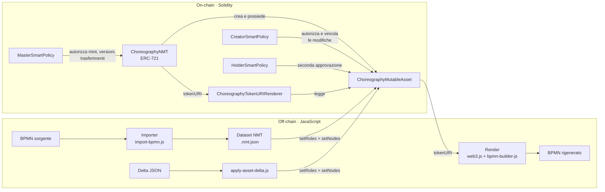
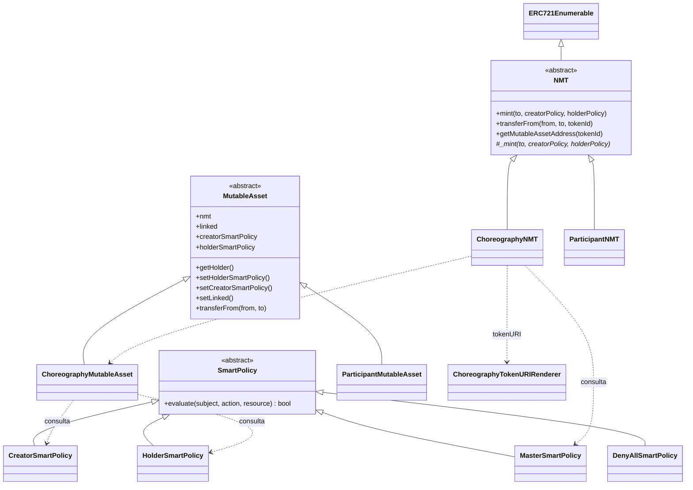
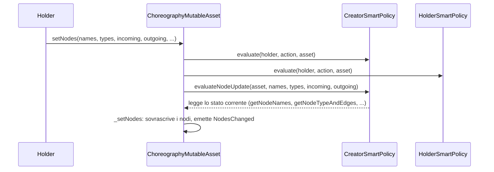

# Architettura di ChorNMT

ChorNMT conserva una coreografia BPMN in un **asset mutabile on-chain**. Un token ERC-721 (l'NMT, *Non-fungible Mutable Token*) ne rappresenta il possesso, le **smart policy** decidono chi può creare, modificare e trasferire, e il BPMN viene **rigenerato** dallo stato on-chain quando serve.

Questo documento descrive i componenti, a cosa servono e come sono fatti al loro interno. La generazione del BPMN dallo stato on-chain ha un documento dedicato: [Rendering](rendering.md).

## Vista d'insieme



Il ciclo di vita tipico ha quattro passi: **deploy** di policy, renderer e NMT, e mint di un asset; **import** di un BPMN nell'asset; **modifica** tramite delta JSON; **render** del BPMN dallo stato corrente. Il BPMN rigenerato è una vista: le modifiche passano sempre dall'asset, mai dal file XML. Comandi e formati sono in [Commands and scripts](commands-and-scripts.md) e [BPMN to NMT workflow](bpmn-to-nmt-workflow.md).

## Principi di progetto

- **Un asset, un contratto.** Ogni token corrisponde a un contratto asset separato e il `tokenId` è l'indirizzo dell'asset (`uint160(address)`). Dal token si risale all'asset senza tabelle di lookup.
- **Autorizzazione separata dai dati.** Gli asset contengono il modello, le policy contengono le regole. Una policy si sostituisce senza toccare il modello, e un asset può usare policy diverse da un altro.
- **Identità per nome.** Nodi e ruoli sono indicizzati per nome: il nome è la chiave usata da delta, vincoli e render. Gli ID BPMN non sono salvati on-chain e vengono rigenerati dai nomi.
- **Scrittura per nodo completo.** `setNodes` sostituisce interamente i nodi indicati. Un delta contiene solo i nodi cambiati, ma ciascuno nel suo stato finale completo.
- **Metadati derivati, non salvati.** `tokenURI` è calcolato dallo stato dell'asset, quindi non può divergere dal modello.

## Livelli e gerarchia dei contratti

```text
contracts/
├── base/
│   ├── NMT.sol                  abstract  ERC721Enumerable: mint, trasferimento con consenso dell'asset
│   ├── MutableAsset.sol         abstract  riferimenti a NMT e policy, modifier di autorizzazione
│   └── SmartPolicy.sol          abstract  evaluate(subject, action, resource)
├── choreography/
│   ├── ChoreographyNMT.sol               NMT delle coreografie, master policy, versioni, tokenURI
│   ├── ChoreographyMutableAsset.sol      modello della coreografia (ruoli e nodi)
│   ├── ChoreographyTokenURIRenderer.sol  genera i metadati JSON dallo stato dell'asset
│   ├── MasterSmartPolicy.sol             chi crea, chi può possedere, trasferimenti e versioning
│   ├── CreatorSmartPolicy.sol            chi modifica e vincoli strutturali BPMN
│   ├── HolderSmartPolicy.sol             seconda approvazione dell'holder
│   ├── DenyAllSmartPolicy.sol            policy che nega tutto (per bloccare un asset)
│   └── IChoreographyCreatorPolicy.sol    interfaccia dei controlli su nodi e ruoli
└── participant/                          livello participant, non usato dagli script (vedi sotto)
```



## Livello base

### `SmartPolicy`

**A cosa serve:** è il contratto astratto di ogni policy. Tutte le decisioni di autorizzazione passano da una sola funzione:

```solidity
function evaluate(address subject, bytes memory action, address resource) public view returns (bool);
```

| Parametro | Contenuto |
| --- | --- |
| `subject` | Chi agisce, di solito `msg.sender`; per i trasferimenti è `from`. |
| `action` | La chiamata codificata ABI: selector (4 byte) seguito dagli argomenti. |
| `resource` | Il contratto interessato: l'asset, oppure l'NMT per i mint. |

`decodeSignature(action)` estrae il selector, e le policy confrontano quel valore con costanti come `bytes4(keccak256("setNodes(...)"))`. Una policy può anche leggere gli argomenti dentro `action`, come fa `MasterSmartPolicy` con `_addressAt(action, offset)` per ricavare holder e Creator policy.

### `NMT`

**A cosa serve:** è la base ERC-721 che collega ogni token al suo asset e che, prima di ogni trasferimento, chiede il consenso all'asset.

**Struttura interna:** non ha stato proprio oltre a quello di `ERC721Enumerable`. Il legame tra token e asset è puramente aritmetico:

```text
tokenId = uint160(address(asset))        asset = address(uint160(tokenId))
```

| Funzione | Comportamento |
| --- | --- |
| `mint(to, creatorPolicy, holderPolicy)` | Rifiuta `to == 0` e delega a `_mint`, che le sottoclassi implementano creando l'asset. |
| `transferFrom(from, to, tokenId)` | Il modifier `transferFromEvaluation` chiama prima `MutableAsset.transferFrom(from, to)` sull'asset, che valuta la Creator policy, e solo dopo esegue il trasferimento ERC-721. |
| `getMutableAssetAddress(tokenId)` | Converte il token nell'indirizzo del suo asset. |

### `MutableAsset`

**A cosa serve:** è la base di ogni asset. Conserva i riferimenti al proprio NMT e alle due policy di istanza e fornisce i modifier di autorizzazione.

**Struttura interna:**

| Stato | Tipo | Significato |
| --- | --- | --- |
| `nmt` | `address immutable` | L'NMT che ha creato l'asset. È l'unico che può chiamare le funzioni `onlyNMT`. |
| `creatorSmartPolicy` | `address` | Policy che esprime le regole del creator. L'holder non può rimuoverla. |
| `holderSmartPolicy` | `address` | Policy scelta dall'holder. Un trasferimento la azzera. |
| `linked` | `address` | Collegamento opzionale verso un altro asset o NMT. Oggi nessuno script lo usa. |

| Modifier | Regola |
| --- | --- |
| `evaluatedBySmartPolicies` | Devono approvare sia la Creator sia la Holder policy. Se la Holder policy è `address(0)` l'operazione fallisce con `"Holder policy disabled"`. |
| `evaluatedByCreator` | Decide solo la Creator policy. Si usa per `transferFrom` e `setCreatorSmartPolicy`. |
| `evaluatedByHolder` | Decide solo la Holder policy. Oggi non è usato. |
| `onlyHolder` | `msg.sender` deve essere il proprietario del token. |
| `onlyNMT` | `msg.sender` deve essere l'NMT. |

| Funzione | Chi decide | Effetto |
| --- | --- | --- |
| `getHolder()` | — | Restituisce `NMT.ownerOf(tokenId)`: il possesso è registrato solo sull'NMT. |
| `setHolderSmartPolicy(address)` | `onlyHolder` | L'holder sceglie la propria policy. |
| `setCreatorSmartPolicy(address)` | Creator policy | La Creator policy decide chi può sostituirla. Quella della coreografia lo consente solo al suo `administrator`. |
| `setLinked(address)` | Creator e Holder | Imposta `linked`. |
| `transferFrom(from, to)` | `onlyNMT` e Creator | Approva il trasferimento e azzera `holderSmartPolicy`: il nuovo holder deve installarne una prima di modificare il modello. |

## Livello coreografia

### `ChoreographyNMT`

**A cosa serve:** conia i token di coreografia, crea un `ChoreographyMutableAsset` per ciascuno, fa passare mint, versioni e trasferimenti dalla Master policy ed espone `tokenURI`.

**Struttura interna:**

| Stato | Tipo | Significato |
| --- | --- | --- |
| `masterSmartPolicy` | `address immutable` | Policy consultata da `evaluatedByMaster` su ogni operazione dell'NMT. |
| `tokenURIRenderer` | `address immutable` | Contratto che genera i metadati. Si passa al costruttore. |
| `predecessorOf` | `mapping(uint256 => uint256)` | Per una versione: il token da cui deriva. |
| `versionOf` | `mapping(uint256 => uint256)` | Numero di versione: 0 per un asset originale, predecessore + 1 per una versione. |

| Funzione | Master policy richiede | Effetto |
| --- | --- | --- |
| `mint(to, creator, holder)` | creator autorizzato, `to` idoneo | Crea un asset vuoto e il suo token. |
| `mintWithInitialModel(to, creator, holder, model)` | creator autorizzato, `to` idoneo | Crea l'asset e lo inizializza con `initializeChoreography(model)` nella stessa transazione. |
| `mintVersion(to, creator, holder, predecessorId)` | versioning attivo, `to` idoneo, chiamante creator autorizzato **oppure** holder del predecessore che mantiene la sua Creator policy | Crea un asset **vuoto** e registra `predecessorOf` e `versionOf`. Il modello non viene copiato. |
| `transferFrom(from, to, tokenId)` | trasferimenti attivi, `subject == from == holder`, `to` idoneo | Poi l'asset valuta la Creator policy e il token viene trasferito. |
| `tokenURI(tokenId)` | — (lettura) | Verifica che il token esista e restituisce `renderer.tokenURI(asset)`. |

Il mint usa `ERC721._mint` e non `_safeMint`: nessuna callback raggiunge il destinatario prima che l'asset sia inizializzato e la sua versione registrata.

**Vincolo di dimensione:** l'NMT contiene il bytecode dell'asset, perché lo crea con `new`. Occupa 22.075 byte su un limite di 24.576. Per questo la generazione del JSON sta in un contratto separato.

### `ChoreographyMutableAsset`

**A cosa serve:** conserva il modello della coreografia (ruoli e nodi), applica le modifiche autorizzate e le fa validare dalla Creator policy.

**Struttura interna.** Tutto il modello è in un unico `Descriptor` privato:

```solidity
struct Descriptor {
    mapping(string => Node)    nodesByName;  // nome -> nodo
    mapping(string => bool)    hasNode;      // esistenza
    string[]                   nodeNames;    // ordine di inserimento, per l'enumerazione
    mapping(string => address) roles;        // nome ruolo -> indirizzo
    mapping(string => bool)    hasRole;
    string[]                   roleNames;
}
```

Le mappe servono per l'accesso diretto per nome, gli array per enumerare, perché in Solidity le mappe non si possono iterare. Un nome già presente viene sovrascritto e non duplicato. Non esiste una funzione di rimozione: gli array crescono e basta.

```solidity
struct Node {
    string   name;               // chiave, uguale alla chiave della mappa
    NodeType nodeType;
    string[] incoming;           // nomi dei nodi predecessori
    string[] outgoing;           // nomi dei nodi successori
    string[] conditions;         // condizione per ogni arco uscente, stesso indice di outgoing
    string   initiatorRole;      // solo task: ruolo che avvia
    string   participantRole;    // solo task: ruolo destinatario
    string   initiatingMessage;  // solo task: messaggio initiator -> participant
    string   returnMessage;      // solo task: messaggio di risposta
}
```

| `NodeType` | Valore | Elemento BPMN |
| --- | ---: | --- |
| `START_EVENT` | 0 | `startEvent` |
| `END_EVENT` | 1 | `endEvent` |
| `TASK` | 2 | `choreographyTask` |
| `EXCLUSIVE_SPLIT` | 3 | `exclusiveGateway` divergente |
| `EXCLUSIVE_JOIN` | 4 | `exclusiveGateway` convergente |
| `PARALLEL_SPLIT` | 5 | `parallelGateway` divergente |
| `PARALLEL_JOIN` | 6 | `parallelGateway` convergente |
| `EVENT_BASED_GATEWAY` | 7 | `eventBasedGateway` |

Gli archi sono salvati **due volte**: `A.outgoing` contiene `B` e `B.incoming` contiene `A`. Il contratto non verifica che i due lati siano coerenti. Per questo un delta che cambia un arco deve includere entrambi i nodi agli estremi.

`InitialModel` è la stessa informazione organizzata "per colonne", come argomento di `mintWithInitialModel`: `roleNames` e `roleAddresses`, più un array per ogni campo di `Node`, tutti della stessa lunghezza.

**Scrittura e ordine dei controlli:**



| Funzione | Controlli | Effetto |
| --- | --- | --- |
| `setRoles(names, addresses)` | Creator e Holder, poi `evaluateRoleUpdate` | Aggiunge o sovrascrive ruoli. Emette `RolesChanged`. |
| `setNodes(...)` (9 array paralleli) | Creator e Holder, poi `evaluateNodeUpdate` | Aggiunge o sovrascrive nodi completi. Emette `NodesChanged`. |
| `initializeChoreography(model)` | `onlyNMT` | Scrive ruoli e nodi del modello iniziale senza controlli strutturali: il modello è fidato. Emette `ChoreographyInitialized`. |
| `tokenURI()` | — | Restituisce `NMT.tokenURI(tokenId)`, lo stesso valore letto dall'NMT. |

| Lettura | Uso |
| --- | --- |
| `getNode(name)` | Tutti i campi di un nodo. La usa il renderer on-chain. |
| `getNodeNames()`, `getRoleNames()`, `getRole(name)` | Enumerazione. La usano il renderer on-chain e i test. |
| `hasNode(name)`, `getNodeTypeAndOutgoing(name)`, `getNodeTypeAndEdges(name)` | Letture compatte per i controlli della Creator policy. |

### Policy della coreografia

| Policy | Stato interno | Decide |
| --- | --- | --- |
| `MasterSmartPolicy` | `administrator` (immutabile), `authorizedCreators`, `eligibleHolders`, `transfersEnabled`, `versioningEnabled` | Operazioni dell'NMT: mint, mint con modello, versioni, trasferimenti. |
| `CreatorSmartPolicy` | `administrator` (il deployer), `maxTaskCount`, `maxSequenceFlowCount`, `enforceTaskNameAllowlist`, `enforceKnownFlowTargets`, `allowedTaskNames`, `protectedNodes` e `protectedNodeCount`, `protectedRoles` | Modifiche dell'holder e vincoli strutturali, più la propria sostituzione (solo `administrator`). |
| `HolderSmartPolicy` | nessuno | Seconda approvazione: consente all'holder `setRoles`, `setNodes` e `setLinked`. |
| `DenyAllSmartPolicy` | nessuno | Nega tutto. Installata come Holder policy, blocca l'asset finché l'holder non la sostituisce. |

I vincoli della `CreatorSmartPolicy` sono tutti disattivati per default. `evaluateNodeUpdate` calcola il modello **dopo** l'aggiornamento: parte dai conteggi correnti e sostituisce i nodi con lo stesso nome. Rifiuta l'aggiornamento se:

- supera il numero massimo di task o di sequence flow;
- contiene nomi vuoti o duplicati;
- contiene un task fuori dall'allowlist, quando attiva;
- ha un estremo di `incoming` o `outgoing` sconosciuto, quando il controllo sugli estremi è attivo;
- modifica un nodo protetto, oppure aggiunge o toglie un collegamento verso di esso.

`evaluateRoleUpdate` rifiuta nomi vuoti o duplicati e ruoli protetti. Le chiavi di allowlist e protezioni sono `keccak256(nome)`.

La tabella completa di chi può fare cosa è in [Choreography policies](choreography-policies.md#who-can-do-what). La semantica dei vincoli e la corrispondenza con i test sono in [Policy test specification](policy-test-specification.md).

### `ChoreographyTokenURIRenderer`

**A cosa serve:** genera i metadati ERC-721 dell'asset leggendone lo stato. È un contratto senza stato, deployato una volta e condiviso da tutti gli asset di un NMT. È descritto in dettaglio in [Rendering](rendering.md#il-renderer-on-chain).

## Livello participant

`ParticipantNMT` e `ParticipantMutableAsset` sono il primo passo verso partecipanti rappresentati come NFT, invece che come semplici nomi di ruolo associati a indirizzi. **Nessuno script li deploya o li usa**, e il modello delle coreografie non li referenzia.

```solidity
struct ParticipantDescriptor {
    bytes32   name;        // nome compatto
    string    bpmn;        // frammento BPMN del partecipante
    bytes32   descriptor;  // descrittore applicativo
    bytes32[] messages;    // identificatori dei messaggi
}
```

Ogni campo ha il suo setter (`setName`, `setBpmn`, `setDescriptor`, `setMessages`), che richiede entrambe le policy ed emette `StateChanged`. A differenza delle coreografie, il participant ha un `tokenURI` salvato e modificabile con `setTokenURI`. Le policy participant consentono tutto all'holder corrente, tranne sostituire la Creator policy.

Oggi le coreografie identificano i partecipanti con nomi di ruolo:

```text
roles["Buyer"] = 0x...     // tipicamente un EOA
node.initiatorRole = "Buyer"
```

L'evoluzione che identifica un partecipante con l'indirizzo del suo `ParticipantMutableAsset` è descritta in [Contract hierarchy](contract-hierarchy.md#target-design-participantmutableasset-address-as-identity), ma non è implementata.

## Componenti off-chain

| Componente | File | Cosa fa |
| --- | --- | --- |
| Importer BPMN | `bpmn-builder-js/scripts/import-bpmn.js` | Legge il BPMN con `bpmn-moddle` e produce un dataset NMT: un nodo per elemento di flusso, con nomi al posto degli ID. Riconosce i gateway convergenti (join) e rifiuta gli elementi non supportati. |
| Popolamento | `scripts/populate-local.js`, `scripts/import-bpmn-asset.js` | Scrive il dataset nell'asset con `setRoles` e `setNodes`. Assegna ai ruoli gli account del nodo locale, in ordine. |
| Delta | `scripts/apply-asset-delta.js` | Valida il delta, invia `setRoles` (se il delta ha `roles`) e `setNodes`, poi fa il render, salvo `--no-render`. |
| Render | `bpmn-builder-js/scripts/web3.js`, `bpmn-builder-js/src/`, `scripts/render-*.js` | Legge `tokenURI` e rigenera il BPMN. Vedi [Rendering](rendering.md). |
| Deploy | `scripts/deploy-local.js` | Deploya Master, Creator e Holder policy, il renderer e l'NMT, poi conia un asset: sei transazioni. |
| Valutazione | `scripts/evaluation/`, `scripts/test-policies.js` | Misura gas e tempi e verifica la matrice delle policy. Vedi [Evaluation](../evaluation/README.md). |

### Formati dei dati

Il **dataset NMT** (`*.nmt.json`) è il formato di scambio tra importer, contratto e render. Ricalca direttamente `Node`:

```json
{
  "schemaVersion": "1.0",
  "id": "Choreography",
  "name": "paper-example",
  "roles": ["Bulk Buyer", "Manufacturer", "Middleman", "Supplier", "Special Carrier"],
  "nodes": [
    {
      "name": "Order",
      "nodeType": 2,
      "incoming": ["Event_0amsrvp"],
      "outgoing": ["Order Intermediate"],
      "conditions": [""],
      "initiatorRole": "Bulk Buyer",
      "participantRole": "Manufacturer",
      "initiatingMessage": "Message_1xwxfgh",
      "returnMessage": ""
    }
  ]
}
```

Il **delta** ha la stessa forma per i nodi, ma contiene solo quelli cambiati, più un blocco `render` con i metadati del BPMN da generare e, opzionalmente, `roles` come mappa nome → indirizzo. Le regole sono in [Delta updates and Solidity calls](delta-update-and-solidity-calls.md).

Il **`tokenURI`** restituisce ruoli e nodi nella stessa forma del dataset, con i ruoli come oggetti `{name, address}`. Vedi [Rendering](rendering.md#formato-dei-metadati).

## Confini di responsabilità

| Livello | Responsabilità | Non fa |
| --- | --- | --- |
| NMT | Possesso, creazione degli asset, versioni, punto d'accesso ai metadati | Non conserva il modello. |
| Asset | Persistenza del modello, applicazione delle modifiche | Non decide chi può modificare. |
| Policy | Autorizzazione e vincoli strutturali | Non conservano il modello. |
| Renderer on-chain | Serializza lo stato in JSON | Non scrive e non ha stato. |
| JavaScript | Conversione tra BPMN e NMT, invio delle transazioni, rigenerazione di XML e layout | Non è fonte di verità: lo è sempre l'asset. |

Grazie a questa separazione si può cambiare una policy senza toccare il formato del modello, cambiare il formato dei metadati deployando un nuovo renderer, e tenere off-chain la parte costosa del render (ID, layout, XML), mentre dati e regole di modifica restano on-chain.
