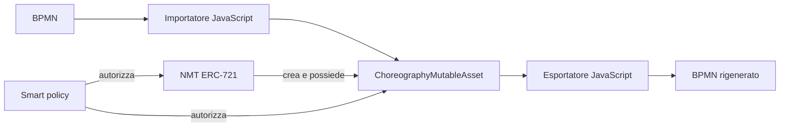

# Architettura di ChorNMT

ChorNMT conserva una coreografia BPMN in un asset mutabile on-chain. Un NFT ERC-721 ne esprime il possesso; le smart policy autorizzano mint, modifiche e trasferimenti.



L'importatore trasforma BPMN in NMT e popola l'asset. Gli aggiornamenti passano da delta JSON e chiamate Solidity; il BPMN rigenerato è una vista dell'asset e non va modificato direttamente. Per formato e comandi: [BPMN to NMT workflow](bpmn-to-nmt-workflow.md) e [Commands and scripts](commands-and-scripts.md).

## Concetti comuni

### NMT e asset mutabile

`NMT` è la base ERC-721. Al mint crea un `MutableAsset` specializzato; il suo indirizzo è anche il token ID (`uint160(indirizzo dell'asset)`). `getMutableAssetAddress(tokenId)` ricava l'asset dal token e `tokenURI` è delegata all'asset. Prima di un trasferimento l'NMT chiede all'asset di valutare la creator policy; l'asset disabilita poi la holder policy e il trasferimento ERC-721 viene completato.

`MutableAsset` contiene il riferimento al proprio NMT (`nmt`), un collegamento opzionale (`linked`), `tokenURI`, `creatorSmartPolicy` e `holderSmartPolicy`. Le modifiche standard richiedono entrambe le policy. Il possessore può cambiare la holder policy; cambiare la creator policy richiede entrambe.

Ogni policy implementa:

```solidity
evaluate(address subject, bytes action, address resource) returns (bool)
```

`subject` è il chiamante, `action` contiene selector e argomenti ABI codificati, e `resource` è l'asset o l'NMT interessato.

```text
NMT (astratto, ERC721Enumerable)
├── ChoreographyNMT
└── ParticipantNMT

MutableAsset (astratto)
├── ChoreographyMutableAsset
└── ParticipantMutableAsset
```

Il token non conserva direttamente il modello: punta implicitamente al contratto asset che lo conserva.

## Asset NMT e coreografia

`ChoreographyNMT` conia token di coreografie e distribuisce un `ChoreographyMutableAsset` per ciascuno. La sua `masterSmartPolicy` autorizza mint, mint atomico, trasferimenti e versioning.

| Operazione | Effetto |
| --- | --- |
| `mint` | Crea un asset vuoto e il relativo NFT. |
| `mintWithInitialModel` | Crea e inizializza asset e modello nella stessa transazione. |
| `mintVersion` | Crea un asset collegato logicamente a un token predecessore. |
| `transferFrom` | Trasferisce il token dopo i controlli master e creator. |

Per una versione, `predecessorOf[tokenId]` identifica il token sorgente e `versionOf[tokenId]` conserva il numero di versione. Il modello del predecessore non viene copiato automaticamente: il nuovo asset nasce vuoto e va popolato separatamente.

`MasterSmartPolicy` conserva administrator, creator autorizzati, holder idonei e i flag per trasferimenti e versioning. Il mint richiede creator autorizzato e holder idoneo; il trasferimento richiede inoltre che il chiamante sia l'holder corrente.

### `ChoreographyMutableAsset`

L'asset conserva un descrittore della coreografia indicizzato per nome:

```text
roles: nome ruolo -> indirizzo
nodes: nome nodo -> Node
```

`roleNames` e `nodeNames` conservano l'ordine di inserimento. Un ruolo o nodo esistente viene aggiornato; non esiste una funzione di rimozione permanente.

| Campo di `Node` | Descrizione |
| --- | --- |
| `name` | Chiave univoca del nodo. |
| `nodeType` | Start/end event, task, gateway esclusivo/parallelo o event-based. |
| `incoming`, `outgoing` | Nomi dei nodi collegati. |
| `conditions` | Condizioni associate ai flussi uscenti. |
| `initiatorRole`, `participantRole` | Ruoli logici della task. |
| `initiatingMessage`, `returnMessage` | Messaggi della task di coreografia. |

`setRoles` aggiorna la mappa ruolo-indirizzo; `setNodes` scrive nodi completi. Alla riscrittura del nodo, ingressi, uscite e condizioni sono sostituiti integralmente. Perciò un delta che cambia un arco deve includere lo stato finale completo di entrambi gli endpoint.

Oltre al controllo combinato creator/holder, `setNodes` invoca `evaluateNodeUpdate` della creator policy. La `CreatorSmartPolicy` della coreografia consente modifiche solo all'holder e può imporre:

- numero massimo di task e sequence flow;
- allowlist dei nomi delle task;
- destinazioni dei flow già note o incluse nello stesso aggiornamento;
- nodi protetti che non possono essere modificati.

Questi vincoli sono illimitati o disattivati per default. `freeze` blocca in modo irreversibile `setRoles`, `setNodes` e `setTokenURI`, con consenso di entrambe le policy. `initializeChoreography` è chiamabile una volta sola dal NMT ed è il percorso interno di `mintWithInitialModel`.

### Identità dei partecipanti

Oggi i nodi usano nomi di ruolo come identità logica, non indirizzi di `ParticipantMutableAsset`:

```text
roles["Buyer"] = 0x...          // tipicamente un indirizzo EOA
node.initiatorRole = "Buyer"
node.participantRole = "Supplier"
```

Il renderer costruisce i partecipanti BPMN da questi nomi. L'evoluzione verso gli indirizzi dei participant asset come identità tecnica, con nomi come label, è solo una proposta: non è implementata. Si veda [Contract hierarchy](contract-hierarchy.md#target-design-participantmutableasset-address-as-identity).

## Asset participant

`ParticipantNMT` usa il comportamento `mint` e `transferFrom` della base NMT e crea un `ParticipantMutableAsset` per token. Non definisce master policy o versioning propri.

`ParticipantMutableAsset` mantiene questo descrittore:

```solidity
ParticipantDescriptor {
    bytes32 name;
    string  bpmn;
    bytes32 descriptor;
    bytes32[] messages;
}
```

| Campo | Uso |
| --- | --- |
| `name` | Nome compatto, codificato in `bytes32`. |
| `bpmn` | Rappresentazione BPMN testuale del partecipante. |
| `descriptor` | Descrittore applicativo compatto. |
| `messages` | Identificatori di messaggio. |

`setName`, `setBpmn`, `setDescriptor`, `setMessages` e `setTokenURI` modificano lo stato ed emettono `StateChanged`; richiedono sempre creator e holder policy. Le due policy participant incluse autorizzano solo l'holder corrente.

## Confini di responsabilità

| Livello | Responsabilità |
| --- | --- |
| Contratti Solidity | Proprietà ERC-721, persistenza, autorizzazioni e vincoli. |
| Script e mapper JavaScript | Conversione BPMN/NMT, transazioni e applicazione delta. |
| Renderer BPMN | Rigenerazione del diagramma dall'asset esportato. |
| Policy | Decisione autorizzativa separata da modello e token. |

La separazione consente di sostituire le policy senza cambiare il formato BPMN e lascia il renderer off-chain, mentre dati e regole di modifica restano on-chain.
