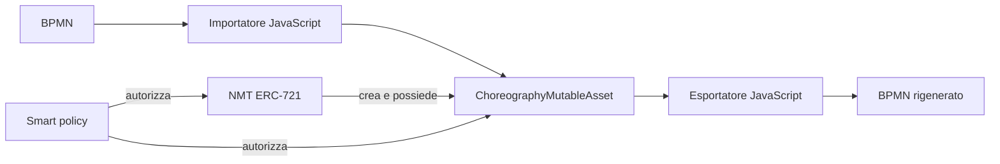

# Architettura di ChorNMT

ChorNMT conserva una coreografia BPMN in un asset mutabile on-chain. Un NFT ERC-721 ne esprime il possesso; le smart policy autorizzano mint, modifiche e trasferimenti.


```mermaid
flowchart LR
  B[BPMN] --> I[Importatore JavaScript]
  I --> C[ChoreographyMutableAsset]
  C --> E[Esportatore JavaScript]
  E --> G[BPMN rigenerato]
  N[NMT ERC-721] -->|crea e possiede| C
  P[Smart policy] -->|autorizza| N
  P -->|autorizza| C
```

L'importatore trasforma BPMN in NMT e popola l'asset. Gli aggiornamenti passano da delta JSON e chiamate Solidity; il BPMN rigenerato è una vista dell'asset e non va modificato direttamente. Per formato e comandi: [BPMN to NMT workflow](bpmn-to-nmt-workflow.md) e [Commands and scripts](commands-and-scripts.md).

## Concetti comuni

### NMT e asset mutabile

`NMT` è la base ERC-721. Al mint crea un `MutableAsset` specializzato; il suo indirizzo è anche il token ID (`uint160(indirizzo dell'asset)`). `getMutableAssetAddress(tokenId)` ricava l'asset dal token e `tokenURI` è delegata all'asset. Prima di un trasferimento l'NMT chiede all'asset di valutare la creator policy; l'asset disabilita poi la holder policy e il trasferimento ERC-721 viene completato.

`MutableAsset` contiene il riferimento al proprio NMT (`nmt`), un collegamento opzionale (`linked`), `tokenURI`, `creatorSmartPolicy` e `holderSmartPolicy`. Le modifiche standard richiedono entrambe le policy. Il possessore può cambiare la holder policy; cambiare la creator policy è valutato solo dalla creator policy corrente (si veda più sotto).

Ogni policy implementa:

```solidity
evaluate(address subject, bytes action, address resource) returns (bool)
```

`subject` è il chiamante, `action` contiene selector e argomenti ABI codificati, e `resource` è l'asset o l'NMT interessato.

```text
NMT (astratto, ERC721Enumerable)
├── ChoreographyNMT
└── ParticipantNMT

MutableAsset (astratto)
├── ChoreographyMutableAsset
└── ParticipantMutableAsset
```

Il token non conserva direttamente il modello: punta implicitamente al contratto asset che lo conserva.

## Asset NMT e coreografia

`ChoreographyNMT` conia token di coreografie e distribuisce un `ChoreographyMutableAsset` per ciascuno. La sua `masterSmartPolicy` autorizza mint, mint atomico e trasferimenti.

| Operazione | Effetto |
| --- | --- |
| `mint` | Crea un asset vuoto e il relativo NFT. |
| `mintWithInitialModel` | Crea e inizializza asset e modello nella stessa transazione. |
| `transferFrom` | Trasferisce il token dopo i controlli master e creator. |

Non esiste un meccanismo di versioning applicativo: la storia del modello è mantenuta dalla blockchain. Ogni modifica accettata è una transazione sull'asset ed emette un evento (`ChoreographyInitialized`, `RolesChanged`, `NodesChanged`), quindi gli stati precedenti si ricostruiscono dalla cronologia delle transazioni e degli eventi.

`MasterSmartPolicy` conserva administrator, creator autorizzati, holder idonei e il flag per i trasferimenti. Il mint richiede creator autorizzato e holder idoneo; il trasferimento richiede inoltre che il chiamante sia l'holder corrente.

### `ChoreographyMutableAsset`

L'asset conserva un descrittore della coreografia indicizzato per nome:

```text
roles: nome ruolo -> indirizzo
nodes: nome nodo -> Node
```

`roleNames` e `nodeNames` conservano l'ordine di inserimento. Un ruolo o nodo esistente viene aggiornato; non esiste una funzione di rimozione permanente.

| Campo di `Node` | Descrizione |
| --- | --- |
| `name` | Chiave univoca del nodo. |
| `nodeType` | Start/end event, task, gateway esclusivo/parallelo o event-based. |
| `incoming`, `outgoing` | Nomi dei nodi collegati. |
| `conditions` | Condizioni associate ai flussi uscenti. |
| `initiatorRole`, `participantRole` | Ruoli logici della task. |
| `initiatingMessage`, `returnMessage` | Messaggi della task di coreografia. |

`setRoles` aggiorna la mappa ruolo → participant asset; `setNodes` scrive nodi completi. Alla riscrittura del nodo, ingressi, uscite e condizioni sono sostituiti integralmente. Perciò un delta che cambia un arco deve includere lo stato finale completo di entrambi gli endpoint.

Oltre al controllo combinato creator/holder, `setNodes` invoca `evaluateNodeUpdate` della creator policy. La `CreatorSmartPolicy` della coreografia consente modifiche solo all'holder e può imporre:

- numero massimo di task e sequence flow;
- allowlist dei nomi delle task;
- estremi dei flow (`incoming` e `outgoing`) già noti o inclusi nello stesso aggiornamento;
- coerenza dei flow: B compare in `A.outgoing` se e solo se A compare in `B.incoming`, nel modello risultante;
- nodi protetti che non possono essere modificati né collegati o scollegati tramite i nodi vicini.

Allo stesso modo `setRoles` invoca `evaluateRoleUpdate`, che rifiuta nomi vuoti o duplicati, i ruoli protetti con `setProtectedRole` e qualsiasi indirizzo che non sia vuoto o un `ParticipantMutableAsset` (si veda sotto). Questo vincolo è sempre attivo.

Questi vincoli sono illimitati o disattivati per default. `initializeChoreography` è chiamabile solo dal NMT ed è il percorso interno di `mintWithInitialModel`, che la invoca una volta su un asset appena creato. Il modello iniziale è considerato fidato: lo fornisce un creator autorizzato dalla master policy e non passa per `evaluateNodeUpdate`. Contiene solo i nomi dei ruoli: i ruoli nascono senza partecipanti.

`setCreatorSmartPolicy` è valutato solo dalla creator policy corrente, non dall'holder: la `CreatorSmartPolicy` della coreografia lo consente soltanto al suo `administrator`, quindi l'holder non può rimuovere i vincoli a cui è sottoposto.

### Identità dei partecipanti

I nodi riferiscono i partecipanti per nome di ruolo; ogni ruolo è associato a un `ParticipantMutableAsset` oppure è ancora vuoto:

```text
roles["Buyer"]    = 0x0000…0000     // ruolo non ancora assegnato
roles["Supplier"] = 0xParticipant…  // indirizzo di un ParticipantMutableAsset
node.initiatorRole   = "Buyer"
node.participantRole = "Supplier"
```

Una coreografia nasce senza partecipanti: l'import e `mintWithInitialModel` creano i ruoli con indirizzo vuoto. Associare un partecipante fa parte dell'evoluzione della coreografia ed è una `setRoles` dell'holder, sottoposta a creator e holder policy. Lo stesso vale per riassegnarlo o riportarlo a vuoto; i ruoli protetti restano bloccati.

Le responsabilità sono divise così:

- la **Master policy** governa solo il token (mint e trasferimenti), non l'evoluzione dei partecipanti;
- la **Creator policy** stabilisce una *categoria* per ruolo con `setRoleCategory(ruolo, categoria)`, senza conoscere indirizzi specifici. Accetta sempre l'indirizzo zero oppure un participant asset tokenizzato (il suo NMT possiede il token il cui ID è l'indirizzo dell'asset) il cui `descriptor` coincide con la categoria del ruolo; un ruolo senza categoria accetta qualsiasi participant asset. Gli EOA e i contratti che non sono participant asset sono sempre rifiutati;
- la **Holder policy** mantiene l'allowlist dei participant asset scelti dall'holder, per asset e per holder corrente (`setAllowedParticipant(asset, participant, bool)`); `setRoles` può usare solo indirizzi in lista. Dopo un trasferimento il nuovo holder parte da una lista vuota.

Il controllo di categoria si basa su ciò che il participant asset dichiara: la garanzia sull'identità del singolo partecipante viene dalla scelta dell'holder, che lo inserisce nella propria allowlist.

Il renderer costruisce i partecipanti BPMN dai nomi dei ruoli; l'indirizzo del participant asset è esportato come metadato. Si veda [Contract hierarchy](contract-hierarchy.md#current-choreography-identity-model).

## Asset participant

`ParticipantNMT` usa il comportamento `mint` e `transferFrom` della base NMT e crea un `ParticipantMutableAsset` per token. Non definisce una master policy propria.

`ParticipantMutableAsset` mantiene questo descrittore:

```solidity
ParticipantDescriptor {
    bytes32 name;
    string  bpmn;
    bytes32 descriptor;
    bytes32[] messages;
}
```

| Campo | Uso |
| --- | --- |
| `name` | Nome compatto, codificato in `bytes32`. |
| `bpmn` | Rappresentazione BPMN testuale del partecipante. |
| `descriptor` | Descrittore applicativo compatto. |
| `messages` | Identificatori di messaggio. |

`setName`, `setBpmn`, `setDescriptor`, `setMessages` e `setTokenURI` modificano lo stato ed emettono `StateChanged`; richiedono sempre creator e holder policy. Le due policy participant incluse autorizzano solo l'holder corrente. La `CreatorSmartPolicy` participant rifiuta `setCreatorSmartPolicy` per chiunque: la creator policy di un participant asset non può essere sostituita.

## Confini di responsabilità

| Livello | Responsabilità |
| --- | --- |
| Contratti Solidity | Proprietà ERC-721, persistenza, autorizzazioni e vincoli. |
| Script e mapper JavaScript | Conversione BPMN/NMT, transazioni e applicazione delta. |
| Renderer BPMN | Rigenerazione del diagramma dall'asset esportato. |
| Policy | Decisione autorizzativa separata da modello e token. |

La separazione consente di sostituire le policy senza cambiare il formato BPMN e lascia il renderer off-chain, mentre dati e regole di modifica restano on-chain.
