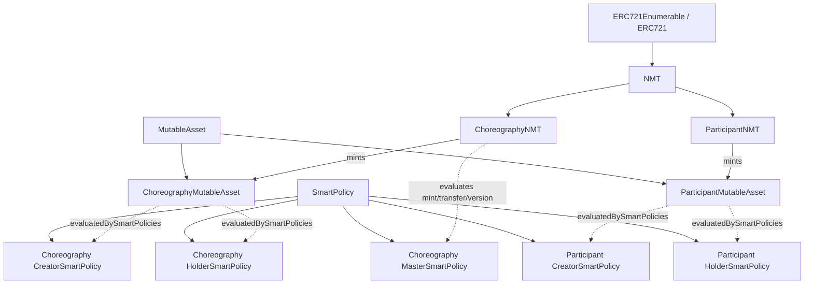
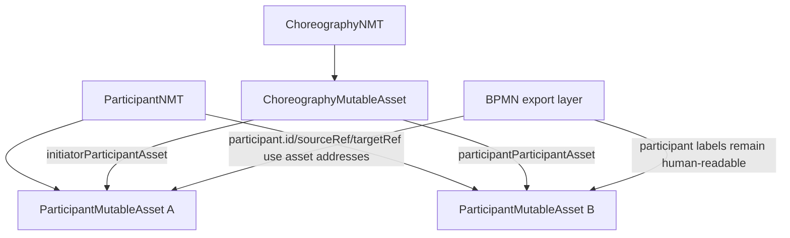

# Contract Hierarchy

This document describes:

- the current contract hierarchy in the repository
- the target design for participant integration where choreography participants are identified by `ParticipantMutableAsset` addresses

The participant-address integration described here is only a design target for now. It is not implemented yet.

## Current Hierarchy

### Base Layer

```text
SmartPolicy

MutableAsset
  - stores:
    - nmt
    - linked
    - tokenURI
    - creatorSmartPolicy
    - holderSmartPolicy
  - enforces smart-policy evaluation on mutable operations

NMT (ERC721Enumerable)
  - mints a MutableAsset-derived contract
  - uses the mutable-asset address encoded as tokenId
  - delegates transfer checks back to the mutable asset
```

### Choreography Layer

```text
ChoreographyNMT : NMT
  - evaluates mint, transfer, and version actions with MasterSmartPolicy
  - deploys ChoreographyMutableAsset on mint
  - can initialize an asset atomically with mintWithInitialModel

ChoreographyMutableAsset : MutableAsset
  - stores choreography descriptor:
    - roles
    - nodes
    - messages embedded in node fields
  - currently identifies participants in nodes by role name strings
  - can be frozen permanently after initialization

MasterSmartPolicy  : SmartPolicy
CreatorSmartPolicy : SmartPolicy
HolderSmartPolicy  : SmartPolicy
```

### Participant Layer

```text
ParticipantNMT : NMT
  -> deploys ParticipantMutableAsset on mint

ParticipantMutableAsset : MutableAsset
  - stores participant descriptor:
    - name
    - bpmn
    - descriptor
    - messages

CreatorSmartPolicy : SmartPolicy
HolderSmartPolicy  : SmartPolicy
```

## Current Object Graph



## Current Choreography Identity Model

Today the choreography model uses participant names as logical identifiers.

Example:

```text
roles = ["Ale", "Fra"]

node.initiatorRole   = "Ale"
node.participantRole = "Fra"
```

This means:

- on-chain choreography nodes refer to participants by role-name string
- exported BPMN participants are keyed first by role/name
- participant smart-contract addresses are not yet the primary identity of choreography participants

## Target Design: ParticipantMutableAsset Address As Identity

### Goal

The target model is:

- technical identity of a participant = address of `ParticipantMutableAsset`
- human-readable label of a participant = participant name / role

So the choreography should stop using only:

```text
"Ale"
"Fra"
```

as primary identifiers, and should instead use something like:

```text
0xParticipantAssetA
0xParticipantAssetB
```

while still preserving readable labels for BPMN rendering.

### Target Relationship



## Target Data Model

### On-chain choreography target

Instead of only:

```text
initiatorRole: "Ale"
participantRole: "Fra"
```

the target model should conceptually become:

```text
initiatorParticipantAsset:  0x...
participantParticipantAsset: 0x...

initiatorRoleLabel:   "Ale"
participantRoleLabel: "Fra"
```

This can be implemented in different ways:

1. Replace role strings with asset addresses directly.
2. Keep role strings for display, but add explicit participant-asset address fields.
3. Keep a role-name to participant-asset mapping on-chain and resolve it in export.

The cleanest model is usually `2`, because it separates:

- identity
- display label

### BPMN export target

The BPMN export should use:

- participant identity keys derived from participant-asset addresses
- readable participant names from participant descriptors

Conceptually:

```json
{
  "participants": [
    {
      "id": "Participant_0xabc...",
      "name": "Ale",
      "address": "0xabc..."
    }
  ]
}
```

And message flows / choreography tasks should resolve participants by the asset address identity, not by the display label.

## Impacted Areas When Implemented

When this design is implemented, these areas will need to change:

- `contracts/choreography/ChoreographyMutableAsset.sol`
  The node descriptor must carry participant-asset identity explicitly or be able to derive it safely.

- `scripts/populate-local.js`
  It currently assigns EOA addresses to roles. It would need to mint or resolve `ParticipantMutableAsset` contracts and use those addresses instead.

- `bpmn-builder-js/scripts/web3.js`
  It currently exports participant identity primarily from role names and only attaches addresses as metadata.

- `bpmn-builder-js/src/normalize.js`
  It currently resolves participant references using `role`, `name`, and `id`. It would need address-first resolution.

- dataset shape under `scripts/data/`
  Today the dataset speaks in role names. A future version would need either participant-asset addresses or a mapping layer.

## Recommended Implementation Direction

If this gets implemented later, the safest direction is:

1. keep human labels in datasets and BPMN output
2. introduce participant-asset addresses as the technical identity
3. make export and normalization resolve participants by address first
4. keep role/name only as display metadata

That keeps the BPMN readable while making the contract model align with the `ParticipantMutableAsset` layer.
