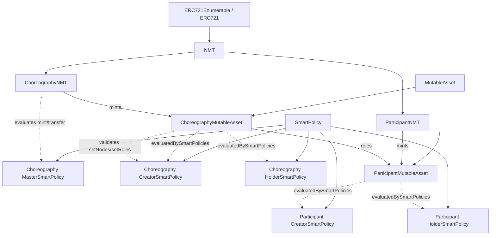
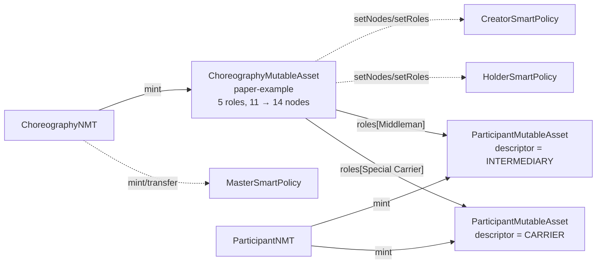
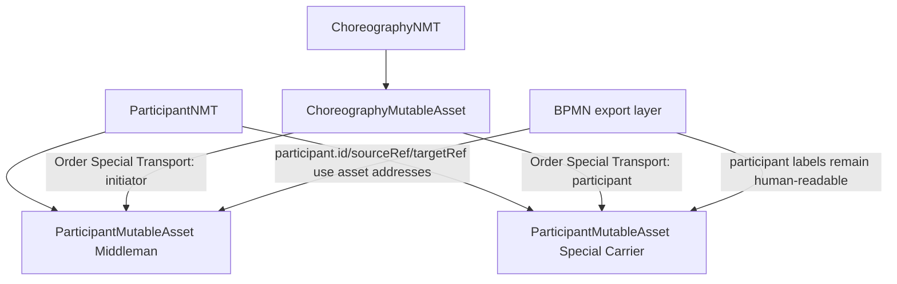

# Contract Hierarchy

This document describes the contract hierarchy and how the `paper-example` choreography ([references/paper-example.bpmn](../references/paper-example.bpmn)) is laid out on it:

- the current hierarchy and the contracts deployed for one `paper-example` instance;
- how its five participants are identified today;
- the target design, where choreography participants are identified by `ParticipantMutableAsset` addresses.

The role → `ParticipantMutableAsset` binding is implemented; using participant-asset addresses as the primary identity in nodes and BPMN export is still a design target.

## The paper example

`paper-example` is a logistics choreography with five roles:

```text
Bulk Buyer, Manufacturer, Middleman, Supplier, Special Carrier
```

The imported model has 11 nodes: a start event, nine choreography tasks, and an end event, from `Order` (Bulk Buyer → Manufacturer) to `Delivery of Product` (Manufacturer → Bulk Buyer). The reusable delta [paper-example-parallel-transport-preparation.delta.json](../scripts/data/paper-example-parallel-transport-preparation.delta.json) inserts a parallel split after `Order Special Transport`, adds the `Prepare Transport Documentation` task, and joins before `Waybill for Intermediate`, for 14 nodes in total.

The examples below use the `Order Special Transport` task:

```text
name               = "Order Special Transport"
nodeType           = 2 (TASK)
initiatorRole      = "Middleman"
participantRole    = "Special Carrier"
initiatingMessage  = "Message_0dai5by"
incoming           = ["FWD Oder Intermediate"]
outgoing           = ["Parallel Transport Preparation Split"]   // after the delta
```

## Current Hierarchy

### Base Layer

```text
SmartPolicy

MutableAsset
  - stores:
    - nmt
    - linked
    - tokenURI
    - creatorSmartPolicy
    - holderSmartPolicy
  - enforces smart-policy evaluation on mutable operations

NMT (ERC721Enumerable)
  - mints a MutableAsset-derived contract
  - uses the mutable-asset address encoded as tokenId
  - delegates transfer checks back to the mutable asset
```

### Choreography Layer

```text
ChoreographyNMT : NMT
  - evaluates mint and transfer actions with MasterSmartPolicy
  - deploys ChoreographyMutableAsset on mint
  - can initialize an asset atomically with mintWithInitialModel

ChoreographyMutableAsset : MutableAsset
  - stores choreography descriptor:
    - roles   (role name → participant asset or zero address)
    - nodes   (node name → Node)
  - messages embedded in node fields
  - identifies participants in nodes by role name strings
  - asks CreatorSmartPolicy to validate every node update (evaluateNodeUpdate)
    and every role update (evaluateRoleUpdate)

MasterSmartPolicy  : SmartPolicy
  - authorized creators, eligible holders, transfer switch (token management only)
CreatorSmartPolicy : SmartPolicy, IChoreographyCreatorPolicy
  - authorizes editors and defines BPMN structural limits, protected roles,
    and the participant category of each role
  - only its administrator may replace it (setCreatorSmartPolicy)
HolderSmartPolicy  : SmartPolicy
  - authorizes the holder and keeps its participant allowlist per asset
```

### Participant Layer

```text
ParticipantNMT : NMT
  -> deploys ParticipantMutableAsset on mint

ParticipantMutableAsset : MutableAsset
  - stores participant descriptor:
    - name
    - bpmn
    - descriptor   (the participant category, e.g. "CARRIER")
    - messages

CreatorSmartPolicy : SmartPolicy
  - allows the holder; denies setCreatorSmartPolicy to everyone
HolderSmartPolicy  : SmartPolicy
```

## Current Object Graph


```mermaid
flowchart TD
  SP[SmartPolicy]
  MA[MutableAsset]
  NMT[NMT]

  OZ[ERC721Enumerable / ERC721]

  CNMT[ChoreographyNMT]
  CMA[ChoreographyMutableAsset]
  CMSP[Choreography MasterSmartPolicy]
  CCSP[Choreography CreatorSmartPolicy]
  CHSP[Choreography HolderSmartPolicy]

  PNMT[ParticipantNMT]
  PMA[ParticipantMutableAsset]
  PCSP[Participant CreatorSmartPolicy]
  PHSP[Participant HolderSmartPolicy]

  OZ --> NMT
  SP --> CCSP
  SP --> CHSP
  SP --> CMSP
  SP --> PCSP
  SP --> PHSP

  MA --> CMA
  MA --> PMA
  NMT --> CNMT
  NMT --> PNMT

  CNMT -- mints --> CMA
  CNMT -. evaluates mint/transfer .-> CMSP
  PNMT -- mints --> PMA

  CMA -. evaluatedBySmartPolicies .-> CCSP
  CMA -. evaluatedBySmartPolicies .-> CHSP
  CMA -. validates setNodes/setRoles .-> CCSP
  CMA -- roles --> PMA
  PMA -. evaluatedBySmartPolicies .-> PCSP
  PMA -. evaluatedBySmartPolicies .-> PHSP
```

## One Paper Example Instance

`deploy:asset` and `import:asset` produce one choreography instance; the participant commands add the participant layer:


```mermaid
flowchart LR
  CNMT[ChoreographyNMT]
  MASTER[MasterSmartPolicy]
  CREATOR[CreatorSmartPolicy]
  HOLDER[HolderSmartPolicy]
  ASSET["ChoreographyMutableAsset<br/>paper-example<br/>5 roles, 11 → 14 nodes"]

  PNMT[ParticipantNMT]
  MID["ParticipantMutableAsset<br/>descriptor = INTERMEDIARY"]
  CAR["ParticipantMutableAsset<br/>descriptor = CARRIER"]

  CNMT -- mint --> ASSET
  CNMT -. mint/transfer .-> MASTER
  ASSET -. setNodes/setRoles .-> CREATOR
  ASSET -. setNodes/setRoles .-> HOLDER

  PNMT -- mint --> MID
  PNMT -- mint --> CAR
  ASSET -- "roles[Middleman]" --> MID
  ASSET -- "roles[Special Carrier]" --> CAR
```

The token ID of the choreography NFT is `uint160(asset address)`; the same holds for each participant NFT. The holder of the choreography token is the only account that can change nodes and roles, within the Creator policy constraints.

## Current Choreography Identity Model

Choreography nodes refer to participants by role name, and the asset keeps a role-name → `ParticipantMutableAsset` mapping on-chain (option 3 below).

Right after `import:asset`, the `paper-example` has no participants:

```text
roles = ["Bulk Buyer", "Manufacturer", "Middleman", "Supplier", "Special Carrier"]
getRole("Middleman")       = 0x0000…0000   // not assigned yet
getRole("Special Carrier") = 0x0000…0000

node["Order Special Transport"].initiatorRole   = "Middleman"
node["Order Special Transport"].participantRole = "Special Carrier"
```

Binding the carrier is part of the choreography evolution:

```bash
npm run deploy:participants
npm run mint:participant -- CARRIER                                            # <carrier-asset>
npm run set:role-category -- <asset-address> "Special Carrier" CARRIER          # creator
npm run assign:participant -- <asset-address> "Special Carrier" <carrier-asset> # holder
```

```text
getRole("Special Carrier") = 0xCarrierAsset   // ParticipantMutableAsset, descriptor "CARRIER"
```

This means:

- a choreography is created without participants: import and `mintWithInitialModel` create every role with the zero address;
- binding, rebinding, or clearing a participant is a holder `setRoles` update, approved by both Creator and Holder policies; protected roles cannot change;
- the choreography `CreatorSmartPolicy` sets a category per role (`setRoleCategory`) and always accepts only the zero address or a tokenized participant asset whose `descriptor` matches that category; assigning a `SUPPLIER` asset, or an externally owned account, to `Special Carrier` is rejected;
- the choreography `HolderSmartPolicy` keeps the holder's allowlist of participant assets per asset and holder (`setAllowedParticipant`); `setRoles` may only use listed addresses;
- on-chain nodes and exported BPMN participants are still keyed by role name; the participant-asset address is exported as metadata in the raw JSON, not in the BPMN XML.

## Target Design: ParticipantMutableAsset Address As Identity

### Goal

The target model is:

- technical identity of a participant = address of `ParticipantMutableAsset`
- human-readable label of a participant = participant name / role

So the `paper-example` would stop using only:

```text
"Middleman"
"Special Carrier"
```

as primary identifiers in its tasks, and would instead use something like:

```text
0xIntermediaryAsset
0xCarrierAsset
```

while still preserving `Middleman` and `Special Carrier` as labels for BPMN rendering.

### Target Relationship


```mermaid
flowchart TD
  CNMT[ChoreographyNMT]
  CMA[ChoreographyMutableAsset]

  PNMT[ParticipantNMT]
  PMA1[ParticipantMutableAsset Middleman]
  PMA2[ParticipantMutableAsset Special Carrier]

  BPMN[BPMN export layer]

  CNMT --> CMA
  PNMT --> PMA1
  PNMT --> PMA2

  CMA -- "Order Special Transport: initiator" --> PMA1
  CMA -- "Order Special Transport: participant" --> PMA2

  BPMN -- participant.id/sourceRef/targetRef use asset addresses --> PMA1
  BPMN -- participant labels remain human-readable --> PMA2
```

## Target Data Model

### On-chain choreography target

Instead of only:

```text
initiatorRole:   "Middleman"
participantRole: "Special Carrier"
```

the `Order Special Transport` task would conceptually become:

```text
initiatorParticipantAsset:   0xIntermediaryAsset
participantParticipantAsset: 0xCarrierAsset

initiatorRoleLabel:   "Middleman"
participantRoleLabel: "Special Carrier"
```

This can be implemented in different ways:

1. Replace role strings with asset addresses directly.
2. Keep role strings for display, but add explicit participant-asset address fields.
3. Keep a role-name to participant-asset mapping on-chain and resolve it in export (implemented today).

Option `2` separates identity and display label most clearly; option `3` keeps every task of a role consistent through a single binding. For example, `Special Carrier` takes part in five tasks of the imported model (`Order Special Transport`, `Request Details`, `Transport Details`, `Waybill for Intermediate`, `Arrival Intermediate`), and one `setRoles` binds all of them.

### BPMN export target

The BPMN export should use:

- participant identity keys derived from participant-asset addresses
- readable participant names from participant descriptors

Conceptually:

```json
{
  "participants": [
    {
      "id": "Participant_0xCarrierAsset",
      "name": "Special Carrier",
      "address": "0xCarrierAsset"
    }
  ]
}
```

And message flows / choreography tasks should resolve participants by the asset address identity, not by the display label.

## Impacted Areas When Implemented

Making participant-asset addresses the primary identity would change these areas:

- `contracts/choreography/ChoreographyMutableAsset.sol`
  The node descriptor must carry participant-asset identity explicitly or be able to derive it safely.

- `bpmn-builder-js/scripts/web3.js`
  It currently exports participant identity primarily from role names and only attaches addresses as metadata.

- `bpmn-builder-js/src/normalize.js`
  It currently resolves participant references using `role`, `name`, and `id`. It would need address-first resolution.

- `scripts/data/paper-example-parallel-transport-preparation.delta.json` and the NMT format
  Today deltas speak in role names (`"initiatorRole": "Middleman"`). A future version would need either participant-asset addresses or a mapping layer.

## Recommended Implementation Direction

If this gets implemented later, the safest direction is:

1. keep human labels in datasets and BPMN output
2. introduce participant-asset addresses as the technical identity
3. make export and normalization resolve participants by address first
4. keep role/name only as display metadata

That keeps the `paper-example` BPMN readable while making the contract model align with the `ParticipantMutableAsset` layer.
