# Rendering: dal modello on-chain al BPMN

Il render rigenera un diagramma BPMN di coreografia a partire dallo stato di un `ChoreographyMutableAsset`. Il contributo è che **l'asset descrive se stesso**: `tokenURI` restituisce, calcolato on-chain, l'intero modello (ruoli, nodi, archi, messaggi) in un formato standard ERC-721. Uno script JavaScript lo legge con una sola chiamata e ne ricava il BPMN completo di layout.

Questo documento descrive le due metà del render: il renderer on-chain e la pipeline off-chain. Per il resto dell'architettura si veda [Architettura](architettura.md).

In sintesi:

- **On-chain nasce il JSON, non il BPMN.** `tokenURI` restituisce il modello in JSON. L'XML BPMN, con ID e layout, lo genera lo script JavaScript.
- **Il JSON è calcolato a ogni chiamata.** Non è salvato da nessuna parte: ogni `tokenURI(tokenId)` legge lo stato corrente di quell'asset. Dopo un `setNodes`, la chiamata successiva restituisce già il modello aggiornato.
- **Un solo renderer per tutte le coreografie.** C'è un unico `ChoreographyTokenURIRenderer` per NMT: riceve l'indirizzo dell'asset e produce il JSON di quella coreografia.

## Perché il render passa da `tokenURI`

| Scelta | Motivazione |
| --- | --- |
| I metadati sono **calcolati dallo stato**, non salvati | Un URI salvato può divergere dal modello: basta aggiornare i nodi e dimenticare l'URI. Un URI calcolato è per costruzione una vista fedele dello stato corrente. |
| Formato **metadati ERC-721** (`name`, `description`) con un campo `choreography` aggiuntivo | Wallet, explorer e indexer che leggono `tokenURI` ricevono JSON valido. Chi conosce ChorNMT trova il modello completo nello stesso documento. |
| Contenuto nella forma del **dataset NMT** | È lo stesso formato prodotto dall'importer e letto dal render, quindi non serve un secondo schema. |
| **Una sola chiamata** di lettura | Prima il render faceva `getRoleNames`, `getNodeNames`, poi una chiamata per ogni ruolo e per ogni nodo: 2 + R + N chiamate RPC, non atomiche tra loro. Ora è una chiamata, che legge uno stato coerente in un unico blocco. |
| **URI `data:`** invece di un link esterno | Nessuna dipendenza da IPFS o da un server: il dato si ottiene dalla sola blockchain. |
| Renderer in un **contratto separato** | L'NMT contiene il bytecode dell'asset ed è vicino al limite di 24 KB. Il renderer ha anche stato zero, quindi un formato nuovo richiede solo di deployare un nuovo renderer insieme a un nuovo NMT, senza cambiare l'asset. |

## Architettura del render

```mermaid
flowchart LR
  subgraph chain[On-chain]
    NMT[ChoreographyNMT.tokenURI] --> TR[ChoreographyTokenURIRenderer]
    CMA[ChoreographyMutableAsset.tokenURI] --> NMT
    TR -->|getRoleNames · getRole<br/>getNodeNames · getNode| CMA
  end
  subgraph js[Off-chain · JavaScript]
    W[web3.js<br/>readChoreography] --> RAW[raw JSON<br/>*.raw.generated.json]
    RAW --> NORM[normalize.js<br/>ID e riferimenti]
    NORM --> VAL[validation.js]
    VAL --> MAP[process-mapper.js<br/>elementi BPMN + layout DI]
    MAP --> GEN[moddle-generator.js<br/>bpmn-moddle]
    GEN --> XML[*.generated.bpmn.xml]
    XML -.-> IMG[render-bpmn-images.js<br/>chor-js + Playwright → SVG/PNG]
  end
  CMA -->|eth_call| W
```



## Il renderer on-chain

`contracts/choreography/ChoreographyTokenURIRenderer.sol` è un contratto **senza stato**. Legge l'asset solo tramite le sue funzioni pubbliche di lettura, dichiarate nell'interfaccia `IChoreographyAssetReader`:

```solidity
interface IChoreographyAssetReader {
    function getRoleNames() external view returns (string[] memory);
    function getRole(string memory role) external view returns (address);
    function getNodeNames() external view returns (string[] memory);
    function getNode(string memory name) external view returns (/* tutti i campi di Node */);
}
```

L'asset quindi non contiene codice di serializzazione, e il renderer non ha privilegi: vede esattamente quello che vede chiunque.

| Funzione | Restituisce |
| --- | --- |
| `tokenURI(asset)` | `"data:application/json;base64," + Base64(metadata(asset))` |
| `metadata(asset)` | Il JSON in chiaro. Utile per il debug e per i test. |

Internamente, il JSON si costruisce in quattro passi:

1. `metadata` compone l'involucro ERC-721: `name` contiene l'indirizzo dell'asset in formato checksum, `description` è fissa.
2. `_rolesJson` itera `getRoleNames()` ed emette `{"name", "address"}`, con l'indirizzo in formato checksum EIP-55.
3. `_nodesJson` itera `getNodeNames()`, nell'ordine di inserimento, e per ogni nodo `_nodeJson` chiama `getNode(name)` ed emette tutti i campi.
4. Ogni stringa passa da `_jsonString`, che la racchiude tra virgolette e applica `Strings.escapeJSON` di OpenZeppelin: virgolette, backslash e caratteri di controllo vengono escapati, UTF-8 resta intatto.

`ChoreographyNMT.tokenURI(tokenId)` verifica che il token esista (`_requireOwned`) e poi delega al renderer. `ChoreographyMutableAsset.tokenURI()` chiama l'NMT, così lo stesso valore è raggiungibile sia dal token sia dall'asset. Il render usa l'asset perché il manifest contiene il suo indirizzo.

### Formato dei metadati

Output reale di `metadata(asset)` per un modello di tre nodi:

```json
{
  "name": "ChorNMT choreography 0x856e4424f806D16E8CBC702B3c0F2ede5468eae5",
  "description": "BPMN choreography stored in a ChorNMT mutable asset.",
  "choreography": {
    "schemaVersion": "1.0",
    "roles": [
      { "name": "Buyer", "address": "0xf39Fd6e51aad88F6F4ce6aB8827279cffFb92266" },
      { "name": "Supplier", "address": "0x70997970C51812dc3A010C7d01b50e0d17dc79C8" }
    ],
    "nodes": [
      { "name": "Start", "nodeType": 0, "incoming": [], "outgoing": ["Delivery"], "conditions": [],
        "initiatorRole": "", "participantRole": "", "initiatingMessage": "", "returnMessage": "" },
      { "name": "Delivery", "nodeType": 2, "incoming": ["Start"], "outgoing": ["End"], "conditions": [""],
        "initiatorRole": "Buyer", "participantRole": "Supplier",
        "initiatingMessage": "requestDelivery", "returnMessage": "deliveryConfirmed" },
      { "name": "End", "nodeType": 1, "incoming": ["Delivery"], "outgoing": [], "conditions": [],
        "initiatorRole": "", "participantRole": "", "initiatingMessage": "", "returnMessage": "" }
    ]
  }
}
```

| Campo | Contenuto |
| --- | --- |
| `choreography.schemaVersion` | Versione del formato, oggi `"1.0"`. |
| `choreography.roles[]` | `name` e `address` di ogni ruolo, in ordine di inserimento. |
| `choreography.nodes[]` | Un oggetto per nodo, con gli stessi campi di `Node` e del dataset NMT. `nodeType` usa la numerazione di `NodeType` (0–7). |

Ruoli e nodi escono sempre nell'ordine di inserimento, e un nodo sovrascritto mantiene la sua posizione. Per lo stesso stato l'output è identico byte per byte.

## La pipeline off-chain

Il comando `npm run render:asset -- <asset> <delta-o-dataset.json>` esegue `scripts/render-asset.js`. Il secondo argomento serve solo per i metadati del BPMN da generare (ID della coreografia, nome, namespace, nome dei file), non per il contenuto: il contenuto viene sempre dall'asset.

| Passo | File | Cosa fa | Output |
| --- | --- | --- | --- |
| 1. Manifest | `scripts/render-local-support.js` (`writeManifest`) | Scrive RPC, indirizzo dell'asset e metadati del BPMN. | `example/contract/*-contract-manifest.generated.json` |
| 2. Lettura | `bpmn-builder-js/scripts/web3.js` (`readChoreography`, `decodeTokenURI`) | Una `eth_call` a `tokenURI()`, verifica il prefisso `data:application/json;base64,`, decodifica e valida la presenza di `choreography.roles` e `choreography.nodes`. | ruoli e nodi in memoria |
| 3. Raw JSON | `web3.js` (`buildRawOutput`) | Traduce il modello per nomi nel formato di input del builder. Nodi con `type` BPMN, archi come chiavi `"A->B"`, messaggi e message flow ricavati da `initiatingMessage` e `returnMessage`, partecipanti dai ruoli. Aggiunge un blocco `contractExport` con indirizzo e data. | `example/input/*.raw.generated.json` |
| 4. Normalizzazione | `bpmn-builder-js/src/normalize.js` | Genera ID BPMN deterministici dai nomi (per esempio `ChoreographyTask_Order`, `Flow_Order_Order_Intermediate`) e risolve tutti i riferimenti per nome o chiave negli ID. | `example/input/*.normalized.generated.json` |
| 5. Validazione | `bpmn-builder-js/src/validation.js` | Controlla la presenza degli ID e che i riferimenti tra nodi, flussi e partecipanti esistano. | — |
| 6. Mapping e layout | `bpmn-builder-js/src/mappers/process-mapper.js` | Produce il descrittore degli elementi BPMN (`Choreography`, `ChoreographyTask`, gateway, `SequenceFlow`, `MessageFlow`, `Message`) e il diagramma DI (vedi sotto). | descrittore in memoria |
| 7. XML | `bpmn-builder-js/src/generators/moddle-generator.js` | Due passate su `bpmn-moddle`. `createSkeleton` crea tutti gli elementi e li indicizza per ID, poi `hydrateElement` imposta gli attributi e trasforma i riferimenti (`sourceRef`, `incoming`, `participantRef`, …) in puntatori agli oggetti. Infine `toXML` serializza. | `example/output/*.generated.bpmn.xml` |
| 8. Immagini (opzionale) | `scripts/evaluation/render-bpmn-images.js` | Apre l'XML nel viewer `chor-js` dentro Chromium, tramite Playwright, ed esporta SVG e PNG. Si usa nella valutazione. | `evaluation/figures/*.generated.{svg,png}` |

### Layout automatico

Il layout non è salvato on-chain. `buildLayout` lo ricalcola a ogni render con un layout a livelli:

- il **rango** di un nodo è la lunghezza del cammino più lungo da un nodo senza archi entranti, calcolata ricorsivamente; i cicli vengono interrotti;
- l'asse **x** dipende dal rango (`252 + rango × 150`);
- i nodi dello stesso rango sono distribuiti sull'asse **y** attorno a una linea centrale (`368`), a distanza `180`;
- le dimensioni dipendono dal tipo di nodo. Per ogni task di coreografia vengono generate anche le due bande dei partecipanti: quella in alto e quella in basso, con quella dell'initiator marcata, e con la visibilità del messaggio.

Il layout è deterministico: lo stesso modello produce sempre lo stesso diagramma.

## Proprietà verificate

| Proprietà | Come è verificata |
| --- | --- |
| Il JSON di `tokenURI` riproduce esattamente il modello scritto | `scripts/test-policies.js`: un asset creato con `mintWithInitialModel` viene decodificato da `tokenURI` e confrontato campo per campo con il modello. `nmt.tokenURI(id)` e `asset.tokenURI()` coincidono. |
| L'escape è corretto | Lo stesso test usa nomi con virgolette, backslash, a capo, tab, lettere accentate e simboli (`Città ✓`). |
| Andata e ritorno BPMN → chain → BPMN senza perdite semantiche | Si importa `references/paper-example.bpmn`, lo si scrive on-chain, lo si renderizza, e poi si reimporta il BPMN generato: il dataset ottenuto coincide con l'originale. Lo stesso vale per il modello evoluto con il delta del gateway parallelo, a meno di `conditions: []` contro `[""]`, che sono equivalenti. |
| Percorso completo | `npm run evaluate:all` e il percorso del README (deploy, import, render, modifica, render). |

## Costi

`tokenURI` è una funzione `view`: letta con `eth_call` non costa nulla a chi la chiama. Il gas che consuma conta però per due motivi. I provider RPC fissano un tetto al gas di una `eth_call`, di solito intorno ai 50M. E se un altro contratto la chiamasse dentro una transazione, quel gas si pagherebbe.

Misure su Hardhat, con una catena lineare di task, due ruoli e messaggi su ogni task:

| Nodi | Gas di `tokenURI` | Lunghezza dell'URI |
| ---: | ---: | ---: |
| 10 | 960.838 | 3.245 caratteri |
| 14 (`paper-example` evoluto, 5 ruoli) | 1.694.862 | 5.493 caratteri |
| 25 | 2.286.537 | 7.485 caratteri |
| 50 | 4.868.479 | 14.553 caratteri |
| 100 | 13.353.869 | 28.685 caratteri |
| 200 | esaurisce il gas su Hardhat | — |

Il costo cresce **più che linearmente**: raddoppiare da 50 a 100 nodi lo moltiplica per 2,7. La causa è la costruzione per concatenazione: ogni `string.concat` alloca una nuova stringa e ricopia tutto il JSON prodotto fino a quel punto. La memoria allocata cresce quindi con il quadrato del numero di nodi, e in EVM anche il costo dell'espansione della memoria è quadratico.

Deploy: il renderer pesa 5.436 byte e si deploya una volta per NMT. Il deploy completo richiede sei transazioni invece di cinque.

## Limiti attuali

- **Dimensione del modello.** Con l'implementazione attuale `tokenURI` resta ben sotto i tetti RPC comuni fino a circa 100 nodi, e non funziona oltre i 150–200. È sufficiente per i modelli del paper. Per modelli più grandi il JSON andrebbe scritto in un unico buffer preallocato: prima si calcola la lunghezza totale, poi si scrive una sola volta, e il costo diventerebbe lineare.
- **Layout non preservato.** Posizioni e ID del BPMN sorgente non sono salvati on-chain: il diagramma rigenerato ha un layout automatico e ID derivati dai nomi, non quelli originali.
- **Direzione dei gateway.** On-chain i gateway sono distinti in split e join (tipi 3–6), ma in BPMN diventano lo stesso elemento senza `gatewayDirection`. Reimportando, l'importer deduce il join dal numero di archi (più entranti, al massimo uno uscente).
- **Condizioni.** Le condizioni degli archi diventano il `name` del `SequenceFlow`, non un `conditionExpression`.
- **Duplicazione JavaScript.** `web3.js` (`buildRawOutput`) e `bpmn-builder-js/src/nmt.js` (`nmtDatasetToBpmnInput`) convertono quasi nello stesso modo un dataset NMT nel formato del builder. Ora che `tokenURI` restituisce un dataset NMT, il render potrebbe usare direttamente `nmtDatasetToBpmnInput`.
- **Asset precedenti.** Gli asset deployati prima dell'introduzione del renderer non hanno `tokenURI()` e non si possono renderizzare con la nuova pipeline.
